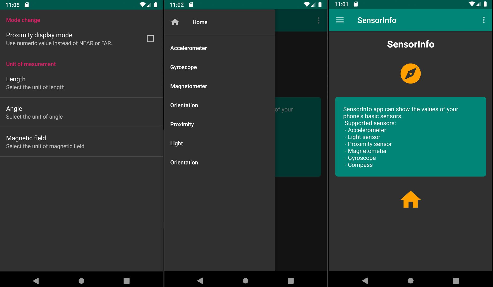

# Built-in sensor tester application to Android 9.0+
This project was created as a homework to the course "Mobile- and Web-based Software (2019)". 

## Main features:
- Supported sensors: Accelerator, Gyroscope, Light- , Magnetic- , Orientation-, Proximity sensor
- Changeable persistent units of scale (metric, imperial)
- Automatically detect available sensors
- Lists vendor, version, max. range, resolution, consumption parameters of each sensor  

## How to use
From the left side can be seen the list of available sensors. Tap one of them to see the data of the selected sensor.

